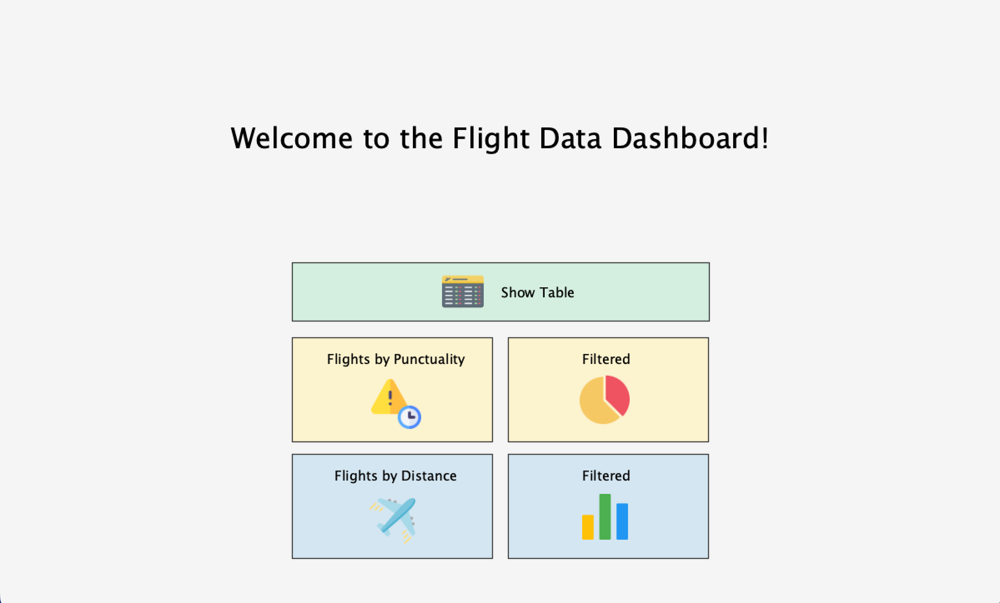

# ✈️ FlightData Explorer

A Processing (Java) application for visualizing and analyzing flight data. Import, explore, and filter flight records from a CSV containing 100,000 flights. Create charts, filter views, and navigate your dataset with ease. This is a weekly progression project documenting my journey in building interactive data visualization tools.

 

---

## 🚀 Features

- 📄 Read and display 100,000 flight records from a CSV file  
- 🛫 Represent each flight as a `FlightEntry` object  
- 🧾 Display flights in a formatted table with proper alignment and time formatting  
- 📊 Visualize punctuality statistics using pie charts  
- 📈 Display flight distances using dynamic bar charts  
- 🔄 Navigate table entries using keyboard-driven drag table functionality  
- 🔍 Filter flights by origin, or using text input for dynamic searching  
- 🎨 Smooth transitions and animations for charts  
- 🖱️ Interactive menu navigation with buttons and icons  
- 🕒 Sort and filter table data based on time and status (e.g., On Schedule)

---

## 🛠 Tech Stack

- **Frontend**: React, Javascript, CSS  
- **Data Handling**: CSV parsing and `FlightEntry` objects  
- **Visualization**: Pie and Bar Charts

---

## 📸 Screenshots

 
 
 
 

---

## 🌍 Project Progress

- **Week 1**: Imported CSV, created `FlightEntry` objects, displayed table, formatted UI  
- **Week 2**: Added pie chart for flight punctuality statistics  
- **Week 3**: Implemented drag table navigation, menu buttons, filter mode, bar chart for distances  
- **Week 4**: Added text input filtering, chart animations  
- **Week 5**: Enhanced home screen with icons, refined table layout, improved scrolling, dynamic filtering, completed video and report
